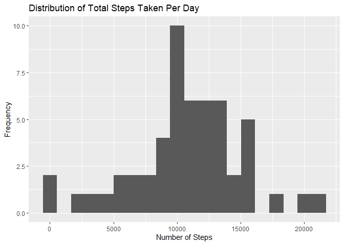
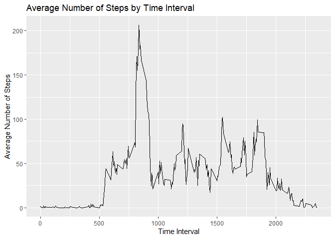
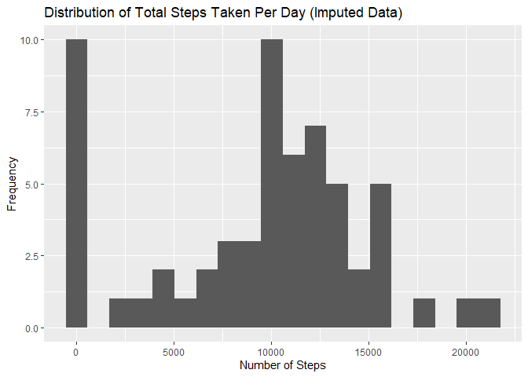
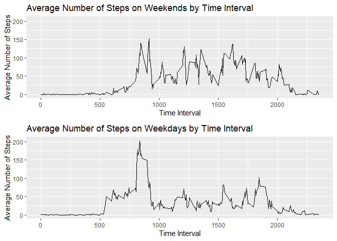

#  Preliminaries

-  read in the activity data
-  create a dataset with no NAs
-  define function multiplot


```r
   library(dplyr)
```

```
## 
## Attaching package: 'dplyr'
```

```
## The following objects are masked from 'package:stats':
## 
##     filter, lag
```

```
## The following objects are masked from 'package:base':
## 
##     intersect, setdiff, setequal, union
```

```r
   library(ggplot2)

   act_dat <- read.csv("data/activity.csv") 
   
   act_noNA <- na.omit(act_dat)
```


```r
   multiplot <- function(...,
                         plotlist = NULL,
                         file,
                         cols = 1,
                         layout = NULL) {
      library(grid)
      
      # Make a list from the ... arguments and plotlist
      plots <- c(list(...), plotlist)
      
      numPlots = length(plots)
      
      # If layout is NULL, then use 'cols' to determine layout
      if (is.null(layout)) {
         # Make the panel
         # ncol: Number of columns of plots
         # nrow: Number of rows needed, calculated from # of cols
         layout <- matrix(seq(1, cols * ceiling(numPlots / cols)),
                          ncol = cols,
                          nrow = ceiling(numPlots / cols))
      }
      
      if (numPlots == 1) {
         print(plots[[1]])
         
      } else {
         # Set up the page
         grid.newpage()
         pushViewport(viewport(layout = grid.layout(nrow(layout), ncol(layout))))
         
         # Make each plot, in the correct location
         for (i in 1:numPlots) {
            # Get the i,j matrix positions of the regions that contain this subplot
            matchidx <-
               as.data.frame(which(layout == i, arr.ind = TRUE))
            
            print(plots[[i]],
                  vp = viewport(
                     layout.pos.row = matchidx$row,
                     layout.pos.col = matchidx$col
                  ))
         }
      }
   }
```


#  Q#1: What is mean total number of steps taken per day?

-  calculate the total number of steps taken per day
-  create a histogram of total steps   
-  compute the mean and median   


```r
   steps_tot <- aggregate(x = act_noNA$steps,    
                          by = list(act_noNA$date), 
                          FUN = sum)              

   ggplot(steps_tot, aes(x = x)) +                           
      geom_histogram(bins=20, na.rm=TRUE) +
      labs(
         x="Number of Steps",
         y="Frequency",
         title = "Distribution of Total Steps Taken Per Day"
      ) 
```

<!-- -->

```r
   mean(steps_tot$x)
```

```
## [1] 10766.19
```

```r
   median(steps_tot$x)
```

```
## [1] 10765
```


#  Q#2: What is the average daily activity pattern?

-  caclulate the average number of steps taken for each 5-minute interval
-  create a time series plot of averages
-  calcluate the maximum number of steps taken during a 5-minute intervale 


```r
   steps_avg <- aggregate(x = act_noNA$steps,    
                          by = list(act_noNA$interval), 
                          FUN = mean)              
   
   
   ggplot(steps_avg, aes(x=Group.1, y=x)) + 
      geom_line() + 
      labs(x="Time Interval", y="Average Number of Steps",
           title="Average Number of Steps by Time Interval")
```

<!-- -->

```r
   max(steps_avg$x)
```

```
## [1] 206.1698
```


#  Imputation for NAs
-  caclulate the number of missing values for steps
-  copy steps variable to imp variable   
-  impute the NAs with the median for stpes   


```r
   NAlist <- is.na(act_dat$steps)   

   table(NAlist)   
```

```
## NAlist
## FALSE  TRUE 
## 15264  2304
```

```r
   act_dat$imp <- act_dat$steps
   
   act_dat$imp[is.na(act_dat$imp)] = median(act_noNA$steps)
```


#  Q#3 How does the distribution of total number of steps 
#  taken in a day with imputed NAs compare with the 
#  distribution in Q#1?


```r
   steps_imp <- aggregate(x = act_dat$imp,    
                          by = list(act_dat$date), 
                          FUN = sum)              
   
   ggplot(steps_imp, aes(x = x)) +                           
      geom_histogram(bins=20, na.rm=TRUE) +
      labs(
         x="Number of Steps",
         y="Frequency",
         title = "Distribution of Total Steps Taken Per Day (Imputed Data)"
      ) 
```

<!-- -->

```r
   mean(steps_imp$x)
```

```
## [1] 9354.23
```

```r
   median(steps_imp$x)
```

```
## [1] 10395
```


#  Q#4: Are there differences in activity patterns between weekdays and weekends?

-  create variable "day" that contains the day of the week for each date
-  create variable "cat" that has value "weekend" if day of the week is a weekend,
-  and has value of "weekday" otherwise.   
-  caclulate the average number of steps taken for each 5-minute interval for
-  weekends and for weekdays   
-  create a time series plot of averages for weekends versus weekdays


```r
   act_dat$day <- weekdays(as.Date(act_dat$date))
   
   act_dat$cat <- ifelse(grepl("Sunday|Saturday", act_dat$day), "weekend", "weekday")   
   

   act_day <- subset(act_dat, act_dat$cat=="weekday")
   act_end <- subset(act_dat, act_dat$cat=="weekend")
   
   steps_day <- aggregate(x = act_day$imp,    
                          by = list(act_day$interval), 
                          FUN = mean)              

   steps_end <- aggregate(x = act_end$imp,    
                          by = list(act_end$interval), 
                          FUN = mean)              
  
   ylim <- max(steps_end$x, steps_day$x)
   
   p1 <- ggplot(steps_end, aes(x=Group.1, y=x)) + 
      geom_line() + 
      labs(x="Time Interval", y="Average Number of Steps",
           title="Average Number of Steps on Weekends by Time Interval") +
      ylim(0, ylim)
   
   p2 <- ggplot(steps_day, aes(x=Group.1, y=x)) + 
      geom_line() + 
      labs(x="Time Interval", y="Average Number of Steps",
           title="Average Number of Steps on Weekdays by Time Interval") +
      ylim(0, ylim)
   
   multiplot(p1, p2, cols=1)
```

<!-- -->
